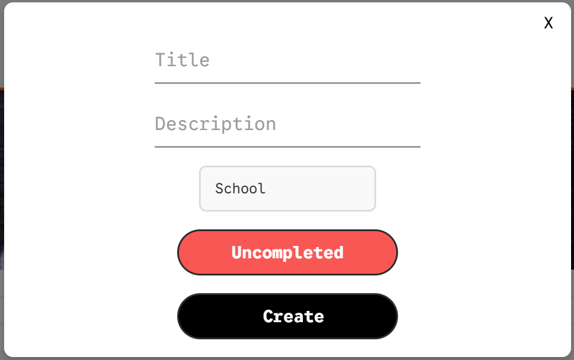

# PersonalStudyApp

A focused, all-in-one **desktop study companion**. Plan tasks, sync your calendar, and listen to music — all in a single window. Built with **React + Vite** and shipped as a native desktop app via **Tauri** with a **MySQL** backend.

> Created and maintained by **Oscar Peach**

---

## ✨ Features

- **Todo Manager (CRUD + persistence)**  
  Create, update, complete, and delete tasks. Data is persisted in **MySQL**.
- **Google Calendar Integration**  
  See events without leaving the app (designed for study planning).
- **Soundcloud / Music Integration**  
  Play music to help you focus while studying.
- **Modern, clean UI**  
  Fast startup, native window chrome, and smooth interactions powered by **Vite + React** inside **Tauri**.

---

## 🧱 Tech Stack

- **Frontend:** React + Vite (HTML, CSS, JavaScript/JSX)
- **Desktop Runtime:** Tauri (Rust)
- **Backend / Storage:** MySQL (SQL schema included in repo)

---

## 📦 Repository Layout

- `src/` – React UI (components, hooks, styles)
- `src-tauri/` – Tauri app (Rust commands, config, bundling)
- `StudyAppToDoList.sql` – MySQL schema for the Todo feature
- `index.html`, `vite.config.js`, `package.json` – Vite/React entry and tooling

---

## 🚀 Quick Start

### 1) Prerequisites
- **Node.js** (v16+)
- **Rust + Cargo** (for Tauri)
- **MySQL Server** (local or container)
- **Visual Studio Build Tools** (Windows only, for compiling Rust)

### 2) Clone & Install
```bash
git clone https://github.com/Oscip/personal-study-app.git
cd personal-study-app
git checkout development

# install frontend dependencies
npm install
```

### 3) Environment Variables
Create a `.env` file in the root directory with the following content (adjust values as needed):
```env
VITE_GOOGLE_CALENDAR_URL="YOUR_GOOGLE_CALENDAR_API_URL"
```
### 4) Run the MySQL Server
If you don’t have MySQL installed, you can run it quickly with Docker:
```bash
  docker run --name mysql -e MYSQL_ROOT_PASSWORD=root -p 3306:3306 -d mysql:8
```

### 5) Database Setup (MySQL)

1. Start MySQL (local or Docker).

2. Create a database user and database (example):
```sql
CREATE DATABASE StudyAppToDoList;
CREATE USER 'study_user'@'localhost' IDENTIFIED BY 'strong_password';
GRANT ALL PRIVILEGES ON StudyAppToDoList.* TO 'study_user'@'localhost';
FLUSH PRIVILEGES;
```

3. Import the schema:

```bash
  mysql -u study_user -p StudyAppToDoList < StudyAppToDoList.sql
```


### 6) Run the Desktop App (Dev)
Go into the project's root directory and run 
```bash
  npm run tauri dev
```

This starts the Vite dev server and launches the Tauri window.

---

## Installation

This application can be installed using either the **MSI installer** or the **NSIS installer**. Both are included in the repository under the `Installation/` folder.

### 1. MSI Installer

1. Navigate to the `Installation/msi/` folder.F
2. Double-click the `.msi` file to launch the installer.
3. Follow the installation wizard to install the app on your system.
4. After installation, launch the app from the Start Menu or desktop shortcut.

### 2. NSIS Installer (Optional / Portable)

1. Navigate to the `Installation/nsis/` folder.
2. Double-click the `.exe` installer file to launch the NSIS installer.
3. Follow the instructions to install or run a portable version of the app.
   - The portable version **does not require installation** and can be run directly from any folder.
4. Launch the app by double-clicking the `.exe` file.

> Both installers include the same version of the app and required files. Choose whichever installation method you prefer.

### ⚠️ Note on Storage

- The app uses **MySQL** to persist your tasks.  
- If you want your data to be saved and synced, make sure to set up MySQL as described in the **Database Setup** section.  
- Without MySQL, the app will still run, but your task data will **not be stored persistently**.


## 🏗️ Building for Production

Tauri makes small, native installers.

Storage: 15–30MB depending on platform.

### build optimized frontend + native app bundle
```bash
npm run build
npm run tauri build
```

The installer/binary will be generated under src-tauri/target/ (platform-specific). (Standard Tauri behavior.)


---


## 🔌 Integrations
### Google Calendar

- View your events directly in the app.

- Requires Google API credentials (set up via Google Cloud Console).


### Soundcloud / Music

- Embedded music for focus.

- No login required; uses public Soundcloud tracks.

---


## Visualisation
### 📸 Screenshots

#### Dashboard / Home


#### Task CRUD




#### Calendar View


#### Music


### 🎥 Short Demo Video

https://github.com/user-attachments/assets/11324ae4-67b1-40f8-b33a-3753789e94a4

---

## 👤 Author

**Oscar Peach** — creator of personal-study-app.
The repository description and README credit Oscar as the author.

---

## 📜 License
This project is licensed under the MIT License - see the [LICENSE](./LICENSE) file for details.
